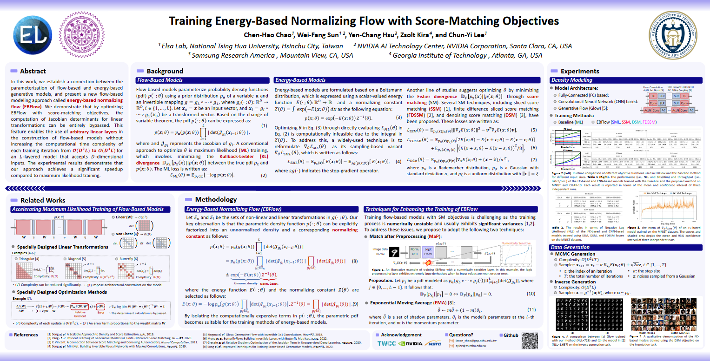

# Poster

In general, posters are created using vector graphics rather than bitmaps. For layout and figures, [Microsoft PowerPoint](https://www.microsoft.com/en-us/microsoft-365/powerpoint) and [Adobe Illustrator](https://www.adobe.com/products/illustrator.html) are recommended.

To create a poster with minimal effort, consider using [@Chen-Hao Chao](https://chen-hao-chao.github.io/)'s poster template via [this link](poster/poster-template.pptx).

## Poster Template

See below for a poster created using this template:

Here are some examples using this template: [DLSM](https://chen-hao-chao.github.io/dlsm/), [QCSBM](https://chen-hao-chao.github.io/qcsbm/), [EBFlow](https://chen-hao-chao.github.io/ebflow/).

> It is worth noting that you should not remove the footer of the poster, which is required by the template's license.
>
> -- [Johnson Sun](https://j3soon.github.io/)

## Poster Printing

### NTHU

There are some less expensive options (around NTD 1,000) for printing a (72x36 inches) poster near National Tsing Hua University (NTHU). For example, you can go to: [玖偵](https://maps.app.goo.gl/DH1F5DeF7XEAGkj87)、[震華](https://maps.app.goo.gl/4a8hBecwEhAmtHAj6)。

<iframe src="https://www.google.com/maps/embed?pb=!1m14!1m8!1m3!1d3622.008154422079!2d120.9955252!3d24.7951743!3m2!1i1024!2i768!4f13.1!3m3!1m2!1s0x34683612a76069b9%3A0x9b6a2a9e8b5d0646!2z546W5YG15b2x5Y2w!5e0!3m2!1szh-TW!2stw!4v1721153210956!5m2!1szh-TW!2stw" width="400" height="300" style="border:0;" allowfullscreen="" loading="lazy" referrerpolicy="no-referrer-when-downgrade"></iframe>
<iframe src="https://www.google.com/maps/embed?pb=!1m14!1m8!1m3!1d452.7560326693212!2d121.0007631!3d24.7938009!3m2!1i1024!2i768!4f13.1!3m3!1m2!1s0x34683612a3dcf0dd%3A0xa96d4ee6ccd1c666!2z6ZyH6I-v5b2p5Y2w5YWJ5b6p5bqX!5e0!3m2!1szh-TW!2stw!4v1721153093973!5m2!1szh-TW!2stw" width="400" height="300" style="border:0;" allowfullscreen="" loading="lazy" referrerpolicy="no-referrer-when-downgrade"></iframe>

Ensure your poster is saved in the `.pdf` format. The staff will assist in resizing your poster to fit their printing formats (e.g., A1, A2). Typically, the poster can be completed within three days.

> Personally, I prefer 震華 over 玖偵, since 玖偵's color may be inconsistent and impure.
>
> -- [Chen-Hao Chao](https://chen-hao-chao.github.io/)
