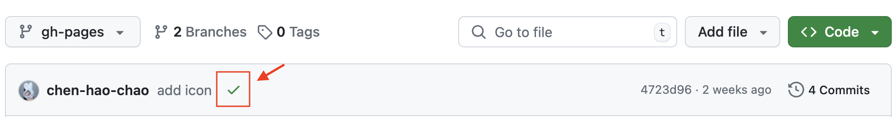

# Project Page

To build a beautiful project page with minimal effort, we recommend using the [Nerfies](https://nerfies.github.io/) webpage as reference by modifying its source code in [this link](https://github.com/nerfies/nerfies.github.io). Alternatively, if you are familiar with Jekyll, you can use the [Academic-project-page-template](https://github.com/eliahuhorwitz/Academic-project-page-template) instead.

## Project Page Template

Here are some examples using this template: [DLSM](https://chen-hao-chao.github.io/dlsm/), [QCSBM](https://chen-hao-chao.github.io/qcsbm/), [EBFlow](https://chen-hao-chao.github.io/ebflow/), [DriveEnv-NeRF](https://muyishen2040.github.io/DriveEnvNeRF/).

## Setup Steps

1. Download the project page template. You can download the [Nerfies template](https://github.com/nerfies/nerfies.github.io) for simplicity.
2. Fill in the details of your project and make sure to remove the Nerfies Google Analytics tag. Check the local version of your project page in your web browser.
3. Push the changes to your GitHub repository.
   1. Checkout to a new branch `gh-pages` and reset to the empty init commit.
   2. Commit your files and push your changes to GitHub.
   3. Wait for a few minutes and see if there is a green checkmark on your GitHub repo.
      
   4. Check your project page link via `Settings > Pages`.
      
   5. Add your project page link to your GitHub repo about section.  
      { width="350" }
      
   6. Optionally add tags to the GitHub repo about section to make it more discoverable.
4. Check your project page link and make sure it looks good.

## Optional Improvements

### Google Search Console

Setup [Google Search Console](https://search.google.com/search-console) for your project page by following the instructions in the [Google Search Console documentation](https://developers.google.com/search/docs/monitor-debug/search-console-start) or from the [help center](https://support.google.com/webmasters/answer/9128668). This allows you to tell Google to index your project page and view the Google search performance of your project page.

1. Submit website for indexing at [Google Search Console](https://search.google.com/search-console/about) and sign in with your Google account.
2. Click `Add a property` and enter the URL of your GitHub project page. For example, if your repository is located at `github.com/<username>/<repo>`, enter `github.com/<username>/<repo>` as the URL.
   
3. Follow the verification steps (i.e., add a header to your project page and push the commit to your GitHub again) to prove that you own the repository.
4. Once your ownership is verified, click on `URL Inspection` in the top bar.
5. Type in the URL of your GitHub repository and click `Enter`.
6. Click on `Request indexing` to tell Google to index your repository.
   
7. Wait for Google to index your repository. This can take several days.

**Reference:** <https://github.com/orgs/community/discussions/42375#discussioncomment-5296219>

### Google Analytics

Setup [Google Analytics](https://analytics.google.com) for your project page by following the instructions in the [Google Analytics documentation](https://support.google.com/analytics/answer/1008015). This allows you to track the number of visitors to your project page.

### More Webpage Features

If you need MathJax support, poster embedding, `Keywords` and `Venue` banners, by referring to the [EBFlow project page](https://chen-hao-chao.github.io/ebflow/) and other potential references.

### SEO Optimization

If you want to optimize your project page for search engines, you can follow the [SEO Starter Guide](https://developers.google.com/search/docs/fundamentals/seo-starter-guide).
